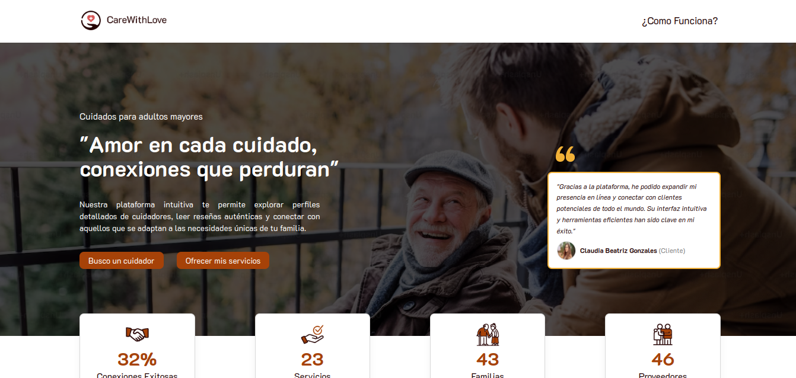
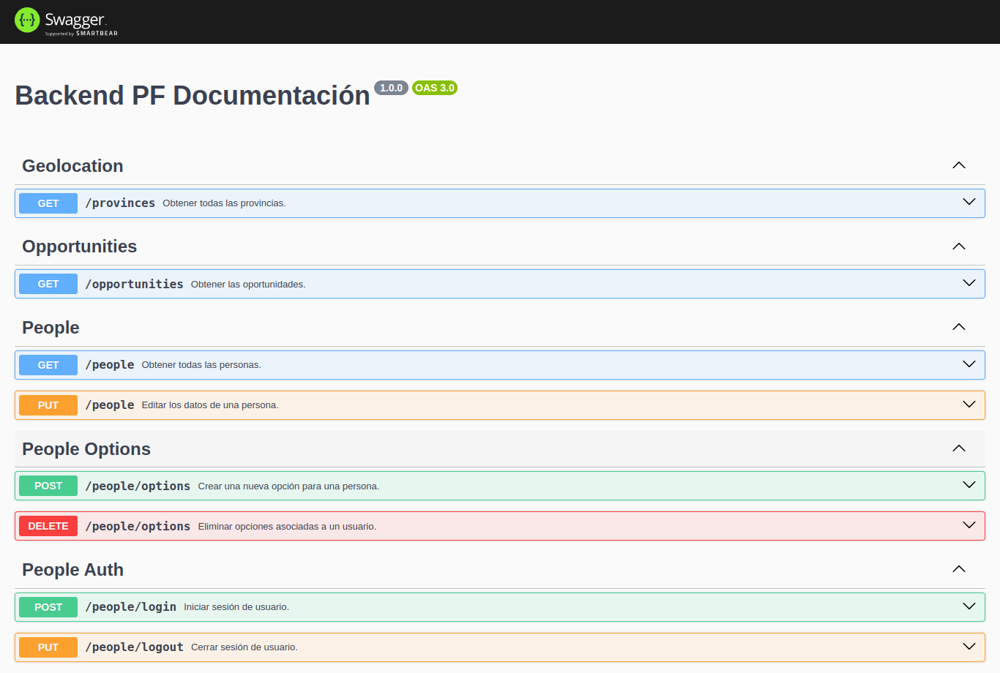

# API REST - Proyecto Final

## Plataforma de Servicios de Asistencia a la Tercera Edad

### En primer lugar, dale una estrella a nuestro repositorio 🌟
Plataforma que conecta a proveedores de servicios de asistencia a la tercera edad con clientes, proporcionando una experiencia transparente y eficiente.

Proyecto academico de conclusion del bootcamp Henry

## Contenido

- [Features](#features)
- [Demo](#demo)
- [Instalación](#instalación)
- [License](#license)
- [Contacto](#contacto)

## Features

- Autenticación de terceros (Google).
- Autenticación local.
- Pasarela de Pagos (Mercado Pago).
- Creación de perfiles para los proveedores.
- Creación de perfiles para los clientes.
- Upload de imagenes (Cloudinary).
- Sistema de calificación y reseñas en los perfiles de proveedores.
- Agenda personal para los proveedores organizaren sus jornadas.
- Listado de perfiles de proveedores.
- Mapa con la ubicación geolocalización de los proveedores.
- Panel del administrador para gestionar usuarios y notificaciones.
- Filtros por valor de servicio, valoración, especialida, ubicación y otras propiedades.
- Chat iterativo en tiempo real para la comunicación entre el cliente / proveedor (socket.io). 
- Edición de perfiles tanto para clientes y para proveedores.

## Demo





## Instalación

Para ejecutar esta API localmente, sigua los siguientes pasos:

1. Clone este repositorio:

```bash
git clone https://github.com/tiago1820/proyecto-final-back.git

```

2. Configura los datos de conección con la base de datos PostgreSQL en el archivo .env .

3. Abra el proyecto en el terminal y ejecute los comandos:

```bash
npm install
npm start
```

## License

Este proyecto tiene la licencia MIT - consulte el archivo [LICENCIA](/LICENCIA) para obtener más detalles.

## Contacto

Puedes contactar a los desarrolladores via Linkedin:
### Backend
- Diego Lepore [linkedin](https://www.linkedin.com/in/diego-lepore/)
- Emmanuel Martinez Zamudio [linkedin](https://www.linkedin.com/in/emmanuel-martinez-zamudio-b17139140/)
- Tiago de Oliveira [linkedin](https://www.linkedin.com/in/tiago1820/)

### Frontend
- Alejo Funes Abdala [linkedin](https://www.linkedin.com/in/alejo-funes-abdala/)
- Leandro Herrera [linkedin](https://www.linkedin.com/in/leandroherrera1002/)
- Pablo (Ariel) Besler [linkedin](https://www.linkedin.com/in/pablo-besler/)
- Ricardo López [linkedin](https://www.linkedin.com/in/josericardolopezsierra/)